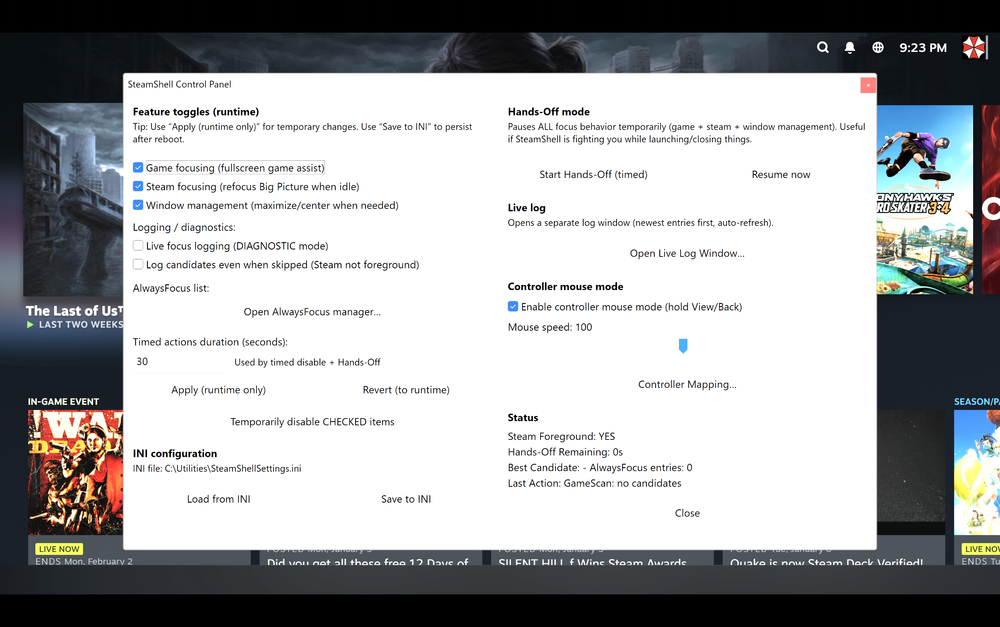

# SteamShell (Steam BPM Focus + Window Helper)

** I won't be providing any support for this and you are using this at your own risk. **

Vibe coded with ChatGPT

## Screenshots

### Control Panel (live in Steam Big Picture)

## What it is

- An AutoHotkey v2 “console/kiosk helper” that launches Steam Big Picture Mode (BPM),
  keeps the right window in front (Steam vs games vs whitelisted apps), optionally
  recenters/maximizes windows, and provides a Control Panel plus controller-to-mouse/keyboard mode.

  ** The .exe file on the releases page was compiled with Ahk2Exe.  If you want to compile your own, please download the .ahk raw file and convert it in ahk2exe.  This was built using ahk version 2.0.19 for 64bit. **

  The included .reg file assumes the SteamShell.exe is located at C:\Utilities\SteamShell.exe.  Please modifiy this file to the location you would like.

## Hotkeys

- Ctrl+Alt+Shift+E : Emergency exit to desktop / restore
- Ctrl+Alt+Shift+R : Reload SteamShellSettings.ini
- Ctrl+Alt+Shift+G : Run Game Foreground Assist (one-shot)
- Ctrl+Alt+Shift+P : Open Control Panel

## Controller chord

- LT + RT + LB + RB + L3 + R3 : Open Control Panel

## Major features

- Steam exit / desktop restore: When Steam closes, SteamShell restores the normal desktop state:
  - Unhides the taskbar
  - Temporarily sets Explorer as the shell (Winlogon Shell)
  - Starts/restarts Explorer so you get a usable desktop
  - Then reverts the shell setting back to SteamShell.exe for next boot

- Steam BPM boot + refocus: Keeps BPM usable as a “shell” after boot, with delay/cooldowns to prevent thrashing.
- Game Foreground Assist: Helps bring “fullscreen-ish” game windows forward when appropriate.
- AlwaysFocus list: A list of EXEs that should win focus over Steam when present.
- Window management: Center windows and maximize only when “large enough,” with an exclusion list.
- Cursor helpers: Optional auto-hide cursor and/or “mouse park” off-screen.
- Logging + live log viewer: Writes a log and provides an in-app live viewer for debugging.
- Hidden Startup Programs: Optional list of extra programs to launch hidden/minimized at boot.
- Controller mouse mode (hold View/Back): Right stick moves mouse, left stick scrolls, D-pad arrows.
  Buttons are configurable (Short/Long) via the Controller Mapping window.

## Explorer “ghost mode” (Game Bar / UWP compatibility)

SteamShell uses an “Explorer ghost mode” approach so you get a console-like experience **without** breaking
Windows features that depend on Explorer/UWP plumbing (notably **Microsoft Game Bar** and other UWP components).

What this means in practice:
- **Explorer is running in the background** to keep required Windows components happy.
- The **taskbar / shell UI is hidden**, so you still get a clean “Steam-first” kiosk feel.
- This helps keep **Game Bar** (Win+G) and other UWP-backed features working, even though you’re not using the
  normal Explorer desktop as your primary shell.

When Steam exits:
- SteamShell performs a full desktop restore (unhide taskbar + start/restart Explorer) so you land on a normal desktop.
- It then resets the Winlogon Shell setting back to SteamShell.exe so the next reboot returns to the SteamShell setup.
