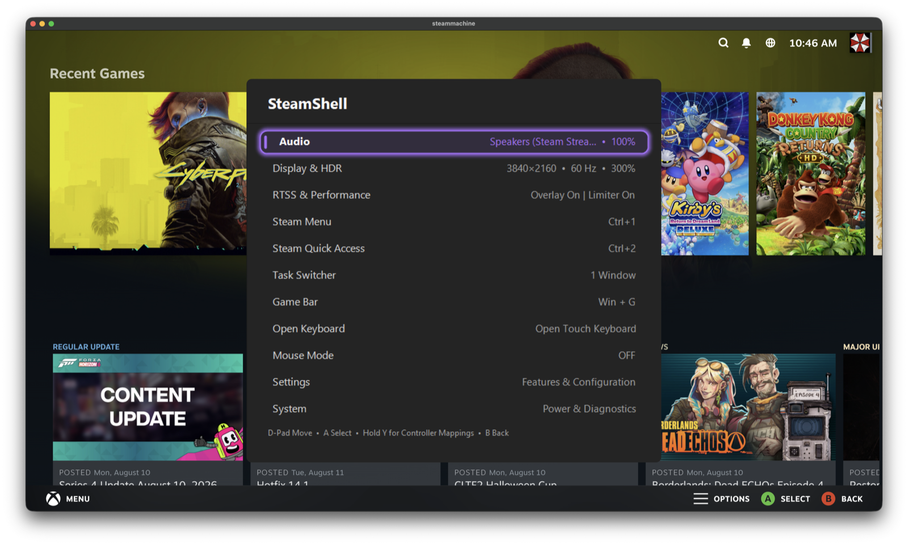
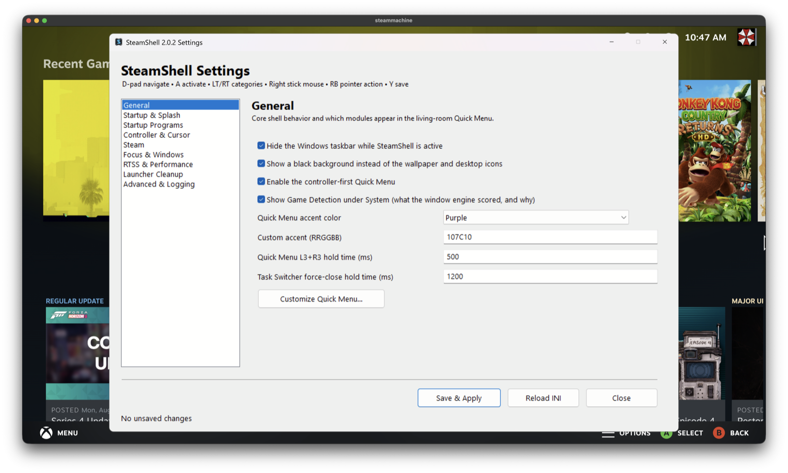
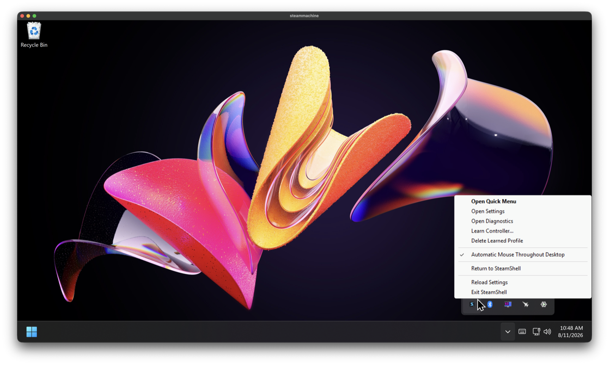

# SteamShell

**Turn a Windows PC into a console. Boot straight into Steam Big Picture, and run the whole
machine from a controller.**

Two programs, one codebase, and **three ways to run them**:

| | What it does | Touches your shell? |
|---|---|---|
| **SteamShell — Shell mode** | Replaces the Windows shell entirely. Windows boots, Big Picture appears, you never see a desktop. | **Yes** |
| **SteamShell — Alongside mode** | The same program as an ordinary app. Explorer keeps the desktop and taskbar; you get the Quick Menu, controller mouse, RTSS control and Launcher Cleanup. Steam is **not** launched unless you ask. | **No** |
| **SteamShell XFE** | The controller half for people running Windows' Xbox Full Screen Experience. | **No** |

Only the first one carries the warning below. It is also the default, because owning the
shell is what the program is *for* — but it is now a choice made at install time, on a
checkbox, and reversible from Settings afterwards.

> [!WARNING]
> **In Shell mode, SteamShell is a Windows shell replacement.** It rewrites the shell
> registry value, terminates `explorer.exe` on its restore paths, and takes over the
> session. **Test it on a machine or account you are prepared to restore.**
>
> `Ctrl+Alt+Shift+E` is the emergency permanent restore: it registers Explorer as the
> shell and closes SteamShell. Learn it before you need it.
>
> **Alongside mode and the XFE companion never write that registry value** and carry none
> of this risk. If you are unsure, start with one of those — you can convert to Shell mode
> later without reinstalling.



*The Quick Menu, over Steam Big Picture. Every row shows its live value, so it reads as a
status panel as much as a control one. D-pad moves, A selects, Left/Right changes a value
without opening anything.*

<details>
<summary><b>More screenshots</b> — Settings editor, tray menu</summary>

### Settings editor

Nine categories, every key the INI holds, navigable with a controller or a mouse.



### Tray menu

The escape hatch — everything here is reachable with a keyboard alone, which is why the
controller learner and its undo live in it.



</details>

**Full picture tour:** every Quick Menu page and every Settings category is in the
[Wiki](https://github.com/jazzphone/SteamShell/wiki).

## Why this exists

Steam Big Picture is a good console interface sitting on top of an operating system that
is not. The gap shows up the moment something goes slightly wrong, and always in the same
way: **you need a keyboard and mouse for something that should have been a button press.**

- A launcher steals focus mid-game and Big Picture is behind it.
- A game exits and leaves its launcher, its updater and an overlay running.
- You want to change resolution, refresh rate, HDR or audio output — all of which live in
  Settings apps designed for a mouse.
- A game opens a dialog off-screen, or on the wrong monitor, or 800×600 in a corner.
- You want to cap frame rate to keep a handheld quiet, which means alt-tabbing to RTSS.
- Something needs closing and there is no Task Manager you can reach with a thumbstick.

None of that is Steam's fault, and none of it is fixable *inside* Steam. It needs
something sitting between Windows and Big Picture that watches what is happening and gives
you controller-reachable answers.

That is what this is. It started as a focus-fixing script and turned into a shell.

The **XFE companion** exists because Microsoft shipped their own console front end, and it
has the same gap — with one extra problem: **XInput reads zeros inside Xbox FSE**, so the
obvious way to read a controller does not work in the exact place you need it. The
companion reads the pad through RawInput instead, and can be taught unfamiliar hardware.

## What you get

### Getting into the game
- Boots to **Steam Big Picture** and keeps it in front
- **Focus scoring** — decides which window really is the game, using shape, CPU and audio,
  rather than grabbing whatever is on top
- **Always Focus** list for applications that should win over Steam
- **Launcher Cleanup** — closes launchers, updaters and overlays after you return to Steam
- **Startup programs**, launched with the shell
- Optional **splash video** while everything comes up

### Running the machine from the sofa
- **Quick Menu** — hold L3 + R3. Display mode, resolution, refresh rate, scale, HDR,
  audio output, frame cap, open windows, and the settings worth changing from a sofa
- **Controller pointer**, with remappable short and long press on every button
- **Task list** — switch to or close any window, including force-close
- **Current Application** — name whatever you were just looking at into an executable
  list, from the Quick Menu, without typing it
- **Windows Start menu and File Explorer** on a controller chord

### Making the controller actually work
- **Two input backends** — RawInput and XInput, selected automatically
- **Controller Learner** — teach it any pad it does not recognise, by pressing buttons,
  and delete a profile that learned wrongly from a hotkey, the tray or Settings
- **Input recovery after sleep**, including the case where Windows never tells you the
  machine woke
- **Smooth cursor** — velocity scaled by real elapsed time, not a fixed step per poll

### Keeping the frame rate sane
- **RTSS** frame limiter and overlay from the Quick Menu
- Global or **per-game profile** caps, keyed on the game the scorer identified
- Optional **elevated helper** for profile writes, so the shell itself stays unprivileged

### Not painting yourself into a corner
- **Setup Assistant** — standard, custom or portable install, with shell registration
  optional and reversible
- **Emergency restore** on a hotkey, and a **Safe Mode** launch that keeps Explorer alive
- **Health Check** and a sanitised **diagnostic bundle**
- Settings **migrate in place** across versions, with versioned backups
- Every executable-list field has a **Recent…** picker offering the last five
  applications you used — including ones you have since closed

## Feature comparison

| | **Shell mode** | **Alongside mode** | **XFE** |
|---|:---:|:---:|:---:|
| **Replaces the Windows shell** | Yes | **No** | **No** |
| Boots to Steam Big Picture | Yes | Optional, off by default | — |
| Window centring, maximising, exclusions | Yes | — | — |
| Full focus scoring engine | Yes | — | Lite |
| Always Focus list | Yes | — | — |
| Taskbar hiding / desktop blackout | Yes | — | — |
| Desktop mode | Yes | n/a | — |
| Splash video | Yes | — | — |
| Setup Assistant and install modes | Yes | Yes | — |
| Task list, switch and force-close | Yes | Yes | — |
| **Quick Menu** | Yes | Yes | Yes |
| Current Application → executable list | 4 destinations | 4 destinations | 2 destinations |
| Recent-application picker in Settings | Yes | Yes | Yes |
| Controller pointer and mappings | Yes | Yes | Yes |
| Controller Learner | Yes | Yes | Yes |
| Input recovery after sleep | Yes | Yes | Yes |
| Display mode, resolution, refresh, scale | Yes | Yes | Yes |
| HDR toggle | Yes | Yes | Yes |
| Audio output switching | Yes | Yes | Yes |
| RTSS frame cap and overlay | Yes | Yes | Yes |
| Launcher Cleanup | Yes | Yes | Lite |
| Startup programs | Yes | Yes | Yes |
| Health Check and diagnostic bundle | Yes | Yes | Yes |
| Runs inside Xbox FSE | — | — | Yes |
| Can be disabled without exiting | — | — | Yes |
| Portable, nothing registered | Optional | Always | Always |

**Shell mode and Alongside mode are the same executable and the same settings file** —
the difference is one key, `[Features] ReplaceWindowsShell`, and whether Windows starts
SteamShell instead of Explorer. Switching between them does not reinstall anything.

The window engine is **off** in Alongside mode by design, not by omission: that mode
assumes a keyboard and mouse are within reach, and a program rearranging windows on an
ordinary desktop is an annoyance rather than a help.

Roughly half the settings are shared between the two products, and the build fails if a
shared behaviour drifts apart.

## The window engine (SteamShell only)

The biggest asymmetry in that table. The standalone shell owns window presentation, so it
runs a single coordinated tick that handles **geometry** and **focus** together — they are
one pass on purpose, because moving a window and deciding what should be in front are the
same decision made twice if you split them.

### Geometry — centring and maximising

Every visible window is considered, and most are immediately ruled out. A window is only
touched if it is:

- titled, visible and in a **normal** state — already minimised or maximised is left alone
- a real application window — not a child window, menu, tooltip, dropdown or a surface
  that cannot take focus
- large enough to be an application rather than a popup, if it has no title bar
- not on your exclusion lists

Surviving windows get two independent decisions:

- **Centred** if it is off-centre by more than a couple of pixels.
- **Maximised** if it is at least `MinWidthPercent` of the screen width (default **30%**)
  *and* the window is actually resizable. A fixed-size dialog is centred, never stretched.

The on-screen keyboard and Steam's own keyboard are skipped, and you can exclude anything
else by **executable** or **window class**:

```ini
[WindowManagement]
MinWidthPercent=0.30
ExcludeExeList=GameBar.exe|YourTool.exe
ExcludeClassList=UnityWndClass|Chrome_WidgetWin_1
```

**It gives up rather than fighting.** Each window gets a bounded correction budget inside a
rolling window; an application that keeps moving itself back is left alone for a while
instead of being wrestled every tick. That is why a stubborn launcher settles rather than
flickering.

**Administrator windows are handled by the elevated helper.** SteamShell itself runs at
normal integrity and cannot move a High-integrity window, so it hands those to the small
verified helper rather than elevating the whole shell.

> **Single display assumed.** Geometry centres against the primary monitor. SteamShell
> is built for a TV or a handheld — one screen, one game — and window placement follows
> that. Game *detection* is per-monitor as of 2.0.0, because the companion runs in
> setups the shell does not, so the two differ deliberately rather than by omission.

### Focus

The other half of the same tick, driven by the scoring described above — shape, then CPU,
then audio, each gate deciding whether the more expensive check is worth running. Geometry
changes defer focus for a tick, so the engine never activates a window it is mid-way
through moving.

Turn the whole thing off with `EnableWindowManagement=false`, or pause it temporarily from
Settings → Advanced.

## Assist Lite (XFE only)

The companion deliberately does **not** have a window engine. Xbox FSE owns presentation,
and a second program moving windows underneath it would be fighting the shell rather than
helping it.

> **Assist Lite never resizes, centres or maximises another application's window.** The
> only geometry XFE applies is the initial window mode of a startup program you asked it
> to launch.

What it does instead is three narrow, independently switchable behaviours:

| Setting | What it does |
|---|---|
| **Game Focus Lite** | Keeps the running game in front when something else steals focus |
| **Steam Assist Lite** | Brings Steam back to the front when a game exits |
| **Launcher Cleanup Lite** | Closes leftover store launchers once no game is running |

All three are off-switchable from the Quick Menu, which writes the change immediately — no
restart, and no need to open the Settings window.

### The safety rules

These matter more than the features, because an assist that misfires inside FSE is worse
than no assist:

- **It pauses entirely while any SteamShell XFE window owns the foreground**, so it can
  never fight the Quick Menu, Settings or one of its own dialogs.
- **The foreground must be stable** for `ForegroundStableSec` (default **30s**) before
  cleanup may run. Nothing is closed during the churn of a game exiting.
- **A game counts as running** if it is fullscreen or borderless, *or* if a process is
  using more than `CpuThresholdPercent` (default **12%**) — which covers a game that has
  minimised itself. Set it to 0 to use window shape alone.
- **Protected processes are never closed**, and launcher cleanup only ever targets the
  list you give it.
- **Graceful close first.** A hard kill is available but is opt-in and time-boxed.
- **The timer only exists when something is enabled.** A default install with all three
  off does no extra polling at all.

```ini
[Assist]
EnableGameFocusLite=true
EnableSteamAssistLite=true
EnableLauncherCleanupLite=true
TickIntervalMs=2000
ForegroundStableSec=30
CpuThresholdPercent=12
```

The same window-scoring code decides which window is the game in both products — it also
drives the per-game RTSS frame cap, where picking the wrong window would write your cap
into another program's profile and report success.

## Download

**[Latest release &rarr; SteamShell.exe](https://github.com/jazzphone/SteamShell/releases/latest)**

One executable installs both products. It embeds the elevated helper and the XFE companion
and deploys whichever you choose through its Setup Assistant.

Verify it if you like — the same binary is committed at
`releases/2.0.2/current/SteamShell.exe`, and its SHA-256 is in
[`releases/2.0.2/RELEASE.md`](releases/2.0.2/RELEASE.md) alongside the exact source that
produced it.

## Getting started

1. Put `SteamShell.exe` somewhere sensible and run it.
2. The **Setup Assistant** opens. Choose a product, confirm the detected Steam path, and
   decide whether to **register as the Windows shell**.
   - Leave that box **ticked** for Shell mode — the full takeover.
   - **Clear it** for Alongside mode: Explorer keeps the desktop and taskbar, nothing is
     written to the shell registry, and you still get the Quick Menu, controller pointer,
     RTSS control and Launcher Cleanup.
3. Press `Ctrl+Alt+Shift+S` for Settings, or hold **L3 + R3** for the Quick Menu.

Changed your mind? **Settings → Advanced & Logging → "Switch to Shell Mode…"** (or
"Switch to Alongside Mode…", depending which you are in) converts between them and
restarts into the other. Nothing is reinstalled.

Requires Windows 10 or 11. Building from source additionally needs AutoHotkey v2.0.19 or
newer, 64-bit.

## Hotkeys

| Key | Action |
|---|---|
| `Ctrl+Alt+Shift+E` | **Emergency permanent restore** — Explorer becomes the shell again |
| `Ctrl+Alt+Shift+Q` | Quick Menu |
| `Ctrl+Alt+Shift+S` | Settings editor |
| `Ctrl+Alt+Shift+P` | Control Panel |
| `Ctrl+Alt+Shift+R` | Reload settings |
| `Ctrl+Alt+Shift+G` | Run Game Foreground Assist once |
| `Ctrl+Alt+Shift+I` | Re-arm controller input |
| `Ctrl+Alt+Shift+D` | Delete the learned controller profile |

On a controller: hold **L3 + R3** for the Quick Menu, hold **View/Back** for the pointer,
and **View/Back + Start** for the Windows Start menu.

## Documentation

The [**wiki**](https://github.com/jazzphone/SteamShell/wiki) is the reader-friendly
documentation — installing, the Quick Menu, settings, controller mappings, teaching a new
controller, and troubleshooting.

In-repo, for depth:

| File | Covers |
|---|---|
| [`SteamShell/README.md`](SteamShell/README.md) | Full standalone reference |
| [`SteamShell/README-XFE.md`](SteamShell/README-XFE.md) | Full companion reference |
| [`SteamShell/CHANGELOG.md`](SteamShell/CHANGELOG.md) | Every change, by release |
| [`STEAMSHELL_PROJECT_OVERVIEW.md`](STEAMSHELL_PROJECT_OVERVIEW.md) | Design decisions and incident write-ups |
| [`SteamShell/WINDOWS_TEST_CHECKLIST.md`](SteamShell/WINDOWS_TEST_CHECKLIST.md) | What to exercise on real hardware |

## Building from source

```
Run-SteamShellValidation.cmd
```

Syntax-checks all five AutoHotkey sources, runs both static validators, compiles the
helper, the companion and the installer, **proves the build gate rejects broken and stale
output**, and only then publishes to `current\`.

Needs Windows, PowerShell 5.1, and AutoHotkey v2 with Ahk2Exe. To build the installer
alone, use `SteamShell\Build-SteamShell.cmd`.

The harness never runs what it compiles, and neither should any automated process.

## How this is built

Two programs share one codebase. `SteamShell-Common.ahk` compiles into all three binaries,
`SteamShell-Shared.ahk` into both main products, and static validators enforce that:

- **Exact function manifests** — a shared function cannot be quietly copied back into one
  tree, and a name cannot appear in both.
- **A duplicate-detection gate** that compares call sequences rather than text, because
  text is the first thing that changes when a copy is tidied.
- **Assertions that pin behaviour, not implementation** — the checks describe what must
  remain true, so correcting a bug does not fail the build for the wrong reason.

[`SteamShell/DIVERGENT_FUNCTIONS.txt`](SteamShell/DIVERGENT_FUNCTIONS.txt) records every
place the two products *deliberately* differ, with the reason — because a divergence
nobody wrote down is indistinguishable from a bug nobody noticed.

That is not incidental tidiness. Several real bugs in this project were in code that was
already shared and simply wrong in both places, or documented as an intentional difference
when it was actually an unported fix. A gate proves two copies agree; it says nothing
about whether they are right.

## Licence and support

**No support is provided. Use at your own risk.**

A personal project, shared in case it is useful to someone with the same problem. It
replaces the Windows shell — please read the warning at the top before running it on a
machine that matters to you.
