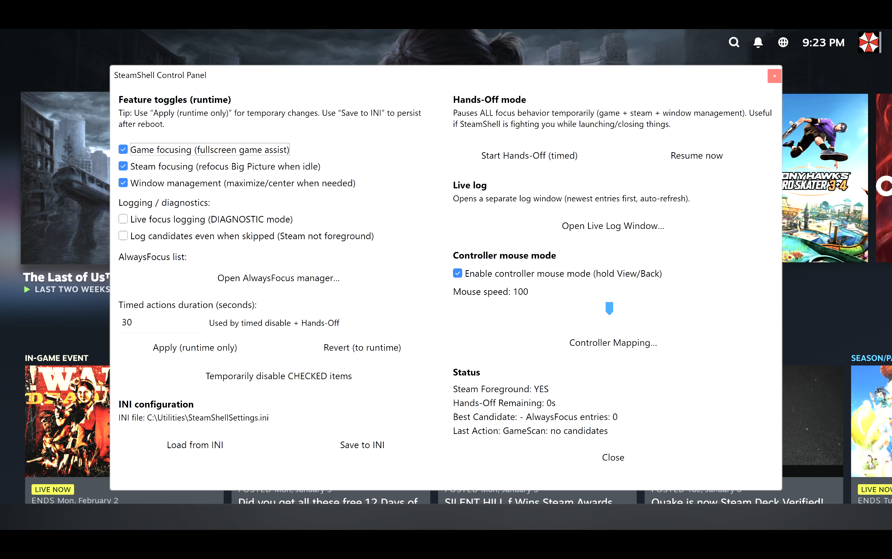

# SteamShell (Steam BPM Focus + Window Helper)

** I won't be providing any support for this and you are using this at your own risk. **

Vibe coded with ChatGPT

## Screenshots

### Control Panel (live in Steam Big Picture)


## What it is

- An AutoHotkey v2 “console/kiosk helper” that launches Steam Big Picture Mode (BPM),
  keeps the right window in front (Steam vs games vs whitelisted apps), optionally
  recenters/maximizes windows, and provides a Control Panel plus controller-to-mouse/keyboard mode.

  **The `.exe` file on the releases page is compiled with Ahk2Exe. SteamShell requires AutoHotkey v2.0.19 or
  newer with a 64-bit base; the 1.5.0 release was tested with AutoHotkey v2.0.26 64-bit.**

  The included `.reg` file remains a manual fallback and assumes `C:\Utilities\SteamShell.exe`. The preferred
  setup method is the single-EXE Install SteamShell action described below.

The validated pre-rewrite 1.4 source baseline is preserved in `releases/1.4.0`. The stable coordinated
window-engine release is preserved in `releases/1.5.0`.

## Settings upgrades

SteamShell synchronizes `SteamShellSettings.ini` with its built-in settings schema during startup. Missing options
are added with their defaults, but existing values—including intentionally blank values—are not overwritten.
Explicitly retired options are removed after any legacy value is transferred to its replacement. Before changing
an older file, SteamShell creates a versioned backup beside it, such as
`SteamShellSettings.ini.pre-schema-0.bak`. Automatically added options may appear at the end of their section
without the descriptive comments included in a newly generated file. Legacy ANSI/UTF-8 INI files are backed up
and converted to UTF-16 for reliable Unicode-path support. Schema migrations and Settings-editor saves are staged
in a temporary copy and replace the live INI only after every change succeeds.

## Hotkeys

- Ctrl+Alt+Shift+E : Emergency exit to desktop / restore
- Ctrl+Alt+Shift+R : Reload SteamShellSettings.ini
- Ctrl+Alt+Shift+G : Run Game Foreground Assist (one-shot)
- Ctrl+Alt+Shift+P : Open Control Panel
- Ctrl+Alt+Shift+Q : Open the controller-first Quick Menu
- Ctrl+Alt+Shift+S : Open the persistent Settings editor

## Controller shortcuts

- Hold L3 + R3 for about 0.7 seconds : Open or close Quick Menu
- Hold View/Back and tap Start : Open the Windows Start menu
- Hold View/Back and hold Start : Open File Explorer
- The mapped Task Manager action uses Windows' native Ctrl+Shift+Esc shortcut. If Windows elevates Task Manager,
  a non-elevated SteamShell cannot control its window or inject mapped mouse input into it.
- LT + RT + LB + RB + L3 + R3 : Emergency/fallback Full Settings chord

Every View/Back mapping, including these Start actions, can be reassigned in the Controller Mapping window. Quick
Menu and Control Panel remain available as optional built-in actions but are unassigned by default.

## Administrator startup

SteamShell restores the behavior used by versions 1.2 and 1.3: if it starts without administrator rights, it
relaunches itself with Windows' `Run as administrator` verb before starting Steam or changing the shell UI. This
allows controller input and window management to interact with elevated Windows surfaces such as Task Manager.
Command-line modes such as `/install`, `/restore`, and `/safe` are preserved during the handoff.

If Windows denies or cancels elevation, SteamShell continues non-elevated instead of leaving the system without a
shell. Health Check reports the active privilege state. With UAC prompting enabled, Windows can display an elevation
prompt at SteamShell startup; programs launched directly by SteamShell can inherit its elevated token.

## Major features

- Steam exit / desktop restore: When Steam closes, SteamShell restores the normal desktop state:
  - Unhides the taskbar
  - Temporarily sets Explorer as the shell (Winlogon Shell)
  - Starts/restarts Explorer so you get a usable desktop
  - Then reverts the shell setting back to SteamShell.exe for next boot
  - Arms automatic restoration only after Steam has actually been observed running, then confirms a sustained exit
  - Verifies the shell registry value and retries Explorer until a real taskbar appears
  - Keeps SteamShell running with a retry prompt if desktop restoration cannot be verified

- Coordinated window engine: Builds one validated window inventory and gives exactly one focus arbiter authority
  over pinned tasks, AlwaysFocus applications, detected games, and the Steam fallback. Geometry changes defer
  focus decisions until the next cycle so centering and activation do not fight each other.
- Steam BPM boot + refocus: Keeps BPM usable as a “shell” after boot, restores the proven partial-title matching
  behavior, and ignores minimized, off-screen, non-activating, and auxiliary Steam windows when deciding whether
  another application truly remains.
- Taskbar Guard: Uses a Windows show-event hook to hide primary and secondary Explorer taskbars as soon as they
  appear, with a low-frequency safety check for recreated or missed taskbar windows. The guard is stopped before
  intentional desktop restoration.
- Game Foreground Assist: Helps bring “fullscreen-ish” game windows forward using cached Win32 process-time
  samples instead of per-candidate WMI queries.
- Legacy game windows: Large, unowned, activatable surfaces from older games can participate even when they have
  no title or use the ToolWindow style. Small, owned, transparent, minimized, and non-activating windows remain
  excluded.
- AlwaysFocus list: A list of EXEs that should win focus over Steam when present. Add one from a currently
  running application or browse directly to its executable.
- Window management: Center windows and maximize only when “large enough,” with an exclusion list, bounded
  correction attempts, HWND/PID revalidation, and automatic cache cleanup.
- Cursor helpers: park the pointer at the active display edge once at boot and after a managed focus change using
  `SetCursorPos` rather than synthetic mouse input. The foreground observer also catches Steam restoring itself
  after a game; a short one-shot settle and verification keep Steam from restoring the old pointer position.
  Periodic checks of an already-focused window do not move the pointer or reset Windows' idle clock, so display-off
  and sleep timers can still expire. Physical mouse movement restores the cursor.
- Logging + live log viewer: Writes a log and provides an in-app live viewer for debugging. Operational notices
  and warnings are always retained; game-candidate scoring remains separately optional.
- Hidden Startup Programs: Optional list of extra programs to launch hidden/minimized at boot.
- Controller mouse mode (hold View/Back): Right stick moves mouse, left stick scrolls, D-pad arrows.
  Buttons are configurable (Short/Long) via the Controller Mapping window.
- Launcher Cleanup - Clean up launchers after exiting your game so no unnecessary tasks run in the background.
  Aggressive process termination is disabled by default.
- Controller-first Quick Menu with live volume/mute, audio output switching, guarded display-mode changes,
  Windows HDR toggle, focus controls, RTSS hooks, and confirmation-protected power actions.
- A compact Windows 11-aware Quick Menu with action and warning details retained in the SteamShell log.

## Quick Menu

The Quick Menu is designed for borderless-fullscreen games and Steam Big Picture. Navigate with the D-pad,
press A to select, B to go back, and left/right to adjust supported values.

- **Compact main page:** Audio, Display + HDR, RTSS performance controls, Focus Assistance, Controller Layout,
  Task Switcher, game/Steam return actions, Settings, and System. Less-frequent controls live in focused submenus.
- **Audio:** the main row shows output and volume; left/right changes volume and A opens output, volume, and mute.
- **Display:** choose from modes reported by Windows. A changed mode automatically reverts after 15 seconds unless
  you select the marked current mode again to keep it. The Display submenu lists every resolution and refresh
  combination reported by Windows and paginates long mode lists.
- **HDR:** sends Windows' built-in Win+Alt+B HDR toggle. Windows does not expose a stable universal HDR status
  query to this AHK build, so the menu labels this operation as a toggle.
- **RTSS:** the RTSS submenu remains visible before setup and reports which configuration is missing. Set
  `[RTSS] EnableIntegration=true`, configure matching shortcuts in RTSS HotkeyHandler, then place those AHK Send
  chords in the overlay and frame-limiter shortcut settings. SteamShell automatically checks RTSS's standard
  installation path when no usable path is configured.
- **Controller Layout:** shows the currently loaded short/long action for every supported View/Back button mapping.
- **Task Switcher:** lists normal visible application windows in Windows' current stacking order. Selecting one
  activates that exact window and applies a session-only focus lock. The lock permits dialogs from the same
  application, releases when the selected window closes, and can be released from Task Switcher or by returning
  to the game/Steam. Press X on a highlighted window to send it a normal Windows close request; SteamShell does
  not force-terminate the process, so applications can still show their own save or confirmation dialogs. Hold X
  for the configured `TaskForceCloseHoldMs` interval to terminate the owning process; this can discard unsaved
  work and closes every window hosted by that process.
- **System:** groups Diagnostics Control Panel, Exit Steam to Desktop, sleep, restart, and shutdown.
- **Exit Steam to Desktop:** gracefully shuts Steam down first, then uses the same Explorer/shell restoration
  path used when Steam exits normally. If Steam does not close, restoration is cancelled rather than leaving a
  partially restored desktop. Automatic restoration remains disarmed until `steam.exe` has actually been observed;
  `SteamStartupGraceMs` controls only a diagnostic warning for unusually slow starts. After Steam has been observed,
  process gaps must last for `SteamExitConfirmMs` before automatic restoration begins.
- **Power:** sleep, restart, and shutdown require a second confirmation.

Exclusive-fullscreen games may minimize when a normal Windows overlay receives focus. Borderless fullscreen is
recommended. AutoHotkey observes XInput but does not suppress it at the driver level, so unusual games that process
controller input while unfocused may still see navigation presses.

## Settings

The Quick Menu includes a controller-friendly **Settings** area with four focused categories:

- **General + Startup:** startup splash, taskbar behavior, and Quick Menu Audio/Display modules.
- **Controller + Cursor:** controller mouse mode and speed, cursor hiding, event-based mouse parking, and the
  controller mapping editor.
- **Focus + Window Engine:** Steam refocus, game foreground assistance, AlwaysFocus support, coordinated window
  management, and the session focus pause.
- **RTSS + Performance:** integration enable, overlay/limiter control modes, and the configured custom frame cap.

Quick Menu changes are written to `SteamShellSettings.ini` immediately. Startup-only rows are marked `NEXT BOOT`.

**Open Full Settings Editor** launches a native Windows editor with General, Startup & Splash, Startup Programs,
Controller & Cursor, Focus & Windows, RTSS & Performance, Launcher Cleanup, and Advanced & Logging categories.
It validates numeric ranges before saving and provides Windows Browse dialogs for Steam.exe, the startup video,
mpv.exe, RTSS.exe, and each of the 20 optional startup-program slots. Its height follows the active monitor's
work area, and long categories use a native Windows scrollbar that stays synchronized with the mouse wheel.

The full editor also supports direct controller navigation while it is foreground: D-pad or left stick moves
between controls, left/right adjusts choices and numeric values, A activates the selected control, LT/RT changes
category, Y saves, and B closes when no changes are pending. The right stick automatically controls the pointer,
and RB runs its configured short action (Left Click by default). Holding View/Back temporarily uses the other
normal configurable mappings, including mapped clicks and shortcuts. Selecting an edit field with A opens the
Windows touch keyboard; unsaved changes are never silently discarded from the controller. Touch-keyboard requests
use Windows' presentation host rather than restarting `TabTip.exe` or `TextInputHost.exe`, with `/SeekDesktop` and
the separately mapped classic OSK available as fallbacks for custom-shell systems.

Settings-owned file pickers temporarily lower the always-on-top editor so the picker always remains accessible,
then restore and reactivate Settings when browsing is finished.

The Startup Programs category provides explicit **Add Program**, **Browse Selected**, **Apply Command**, and
**Remove Selected** actions, along with **Test Launch**, reordering, and Hidden/Minimized/Normal window modes.
New programs use the selected empty slot or the next available slot, while replacing an executable preserves
arguments already entered after it. The full editor applies runtime-compatible changes when **Save & Apply** is
selected and identifies options that require the next launch.
The RTSS shortcut rows include **Record** buttons that capture a key combination and convert it to the required
AutoHotkey send syntax. Advanced & Logging includes the common focus, game-assist, reload, INI, and live-log
actions; the separate Diagnostics Panel remains available for timed overrides and detailed runtime status.

Advanced & Logging also provides **Install SteamShell as Shell**, **Repair SteamShell Installation**, and
**Permanently Restore Explorer**.
These actions use the same compiled EXE—there is no companion service, updater, or recovery executable.

The same area provides configuration recovery and diagnostics:

- **Health Check** validates Steam, the INI/schema, shell registration, Explorer/taskbar, startup paths, RTSS,
  controller detection/mapping conflicts, Launcher Cleanup safety, and desktop recovery.
- **Export Diagnostic ZIP** creates a sanitized bundle on the desktop containing the health report, system
  information, settings, and recent log lines.
- **Create Settings Backup**, **Export Settings**, and **Import / Restore** preserve portable configurations.
- **Restore Category Defaults** and **Reset All Settings** create backups before changing anything.
- **Restart in Safe Mode** keeps Explorer available and disables shell automation for the current session.
- **Setup Assistant** connects Steam/RTSS selection, controller testing, Health Check, portable use, installation,
  and recovery without a separate installer.

The Focus and Launcher Cleanup categories use executable-list editors rather than raw pipe-separated text.
Launcher Cleanup includes its background-helper list and a read-only preview of currently running cleanup targets.
Controller & Cursor includes a live controller test; inputs are captured instead of forwarded through mappings,
and a three-second centered-stick sample can calculate and apply a conservative deadzone.

Focus & Windows exposes the user-facing Steam refocus, game assistance, foreground-sensitivity preset,
AlwaysFocus, coordinated window-management toggle, maximize-width percentage, and exclusion controls. Foreground
sensitivity defaults to Responsive (55); Balanced (60) and Conservative (70) remain available without exposing
the individual CPU, audio, title, and geometry score components. The coordinated engine's scan cadence, retry
budget, and process sampling cadence use conservative internal defaults so ineffective timing combinations cannot
be configured. Quick Menu reports Window Management as `COORDINATED`, while Health Check and Diagnostics report
the last inventory size, scan duration, decision, and cumulative geometry/focus actions.

The Settings editor disables options that do not apply to the selected RTSS mode, Launcher Cleanup safety
configuration, or logging detail. `GameLogMode=OFF` is the single logging disable state; the former duplicate
logging checkbox is removed during settings migration. Steam is intentionally omitted from the AlwaysFocus Manager
because Steam fallback already has a dedicated place in the focus policy and allowing it into AlwaysFocus would
make it outrank games.

**Customize Quick Menu** can reorder the main rows and hide optional entries. Settings and System are always
retained as recovery paths even if the stored order is malformed.

## Single-EXE setup and recovery

SteamShell can install itself for the current Windows user. Compile the EXE, run it once from the normal desktop,
open Full Settings, and select **Install SteamShell as Shell**. The setup action:

- Copies the EXE to `%LocalAppData%\SteamShell\SteamShell.exe`
- Copies the current INI when the installed location does not already have one
- Saves the previous per-user Windows shell value
- Verifies the new shell registration
- Adds an emergency Restore Windows Desktop shortcut to the current user's Start menu

The main application runs unelevated. Optional operations that require additional Windows permissions can fail
cleanly without elevating SteamShell and every program it launches.

The same EXE supports these command modes:

```text
SteamShell.exe /install
SteamShell.exe /repair
SteamShell.exe /restore
SteamShell.exe /uninstall
SteamShell.exe /safe
SteamShell.exe /selftest
```

Use `/install` and `/repair` from the normal Explorer desktop when another SteamShell instance is not active.
While SteamShell is running, use the equivalent buttons in Full Settings. `/restore` and `/uninstall` intentionally
replace the active instance so they can recover the desktop.

`/restore` and `/uninstall` both permanently register Explorer as the Windows shell and start a verified desktop.
They deliberately leave the SteamShell folder and INI in place so recovery never deletes user data. If SteamShell
is forcibly ended, open Task Manager with Ctrl+Shift+Esc, choose **Run new task**, and run:

```text
%LocalAppData%\SteamShell\SteamShell.exe /restore
```

If Steam itself cannot start, SteamShell displays a recovery window with Retry Steam, Open Settings, and Restore
Desktop. The D-pad selects an action and A activates it.

`/safe` does not change the saved INI or permanent shell registration. It starts Explorer, skips Steam and startup
programs, disables the splash, cursor parking/hiding, window/focus automation, and Launcher Cleanup, then opens
Full Settings. Reloading the INI during that session cannot re-enable the disabled modules.

`/selftest` runs parser, schema, list-normalization, Quick Menu ordering, startup-command, and process-time CPU
calculation invariants without starting the normal shell session.

## Build validation

`Build-SteamShell.ps1` runs `Validate-SteamShell.ps1` before asking AutoHotkey to validate and compile the script.
The static validator checks duplicate function declarations, embedded/sample INI schema parity, required recovery
and window-engine functions, Settings-editor and Quick Menu schema bindings, named UI/timer callbacks, Quick Menu
row dispatch, ampersand-safe Settings headings, the controller-deadzone migration, desktop-restore linkage,
whitespace hygiene, one full-window scanner, and one scheduled focus-policy call. It also rejects the retired WMI
process query and legacy focus entry points.

## Optional RTSS setup

SteamShell pre-fills RTSS's standard executable path and `OverlayToggleShortcut=^+o` (Ctrl+Shift+O), but leaves
the integration disabled until setup is complete. Configure Ctrl+Shift+O as the matching overlay hotkey in RTSS
HotkeyHandler, then set `[RTSS] EnableIntegration=true`. SteamShell sends the shortcut; it does not modify RTSS's
internal hotkey configuration.

`OverlayControlMode=Toggle` preserves the simple one-key setup. Because a toggle does not report its resulting
state, SteamShell labels the action `TOGGLE` and reports only whether the RTSS process is ready or running. It never
claims the overlay itself is on or off.

For deterministic controls, configure separate Show OSD and Hide OSD hotkeys in RTSS or MSI Afterburner:

```ini
OverlayControlMode=Separate
OverlayOnShortcut=^+1
OverlayOffShortcut=^+2
```

Separate mode displays explicit Overlay On and Overlay Off actions. Ctrl+Shift+1 and Ctrl+Shift+2 are prefilled;
configure exactly the same Show and Hide actions in RTSS or MSI Afterburner.

The frame limiter uses one custom target rather than a baked list of presets:

```ini
[RTSS]
EnableIntegration=true
Path=C:\Program Files (x86)\RivaTuner Statistics Server\RTSS.exe
OverlayToggleShortcut=^+o       ; Ctrl+Shift+O
FrameLimiterControlMode=Toggle
CustomFrameCap=117
CustomFrameCapShortcut=^+f      ; Ctrl+Shift+F
```

In Toggle mode, the Quick Menu displays `TOGGLE • 117 FPS` but does not claim the limiter is on or off. SteamShell
does not write RTSS's numeric limit; `CustomFrameCap` is the target displayed in the menu, so configure RTSS to use
the same value. A value of `0` simply hides the FPS label.

For explicit limiter controls, configure matching enable and disable actions:

```ini
FrameLimiterControlMode=Separate
CustomFrameCap=117
FrameLimiterOnShortcut=^+5
FrameLimiterOffShortcut=^+6
```

Separate mode displays Frame Limiter On and Frame Limiter Off. Ctrl+Shift+5 and Ctrl+Shift+6 are prefilled; configure
matching enable and disable actions in RTSS. The retired `FrameCapOptions`, `FrameCap0Shortcut`, and numbered
`FrameCap...Shortcut` fields are ignored if they remain in an older settings file.

## Building the executable

SteamShell remains compatible with AutoHotkey v2.0.19 and newer and compiles into one executable with Ahk2Exe.
Release 1.5.0 was tested with AutoHotkey v2.0.26 64-bit. On Windows, install AutoHotkey v2 with its compiler and
run:

```powershell
powershell -ExecutionPolicy Bypass -File .\Build-SteamShell.ps1
```

The build script creates `dist\SteamShell.exe`. Windows-specific features must be tested on the intended HTPC;
they cannot be executed or validated from a macOS development machine.

SteamShell intentionally rejects a 32-bit AutoHotkey base. If compiling through the Ahk2Exe GUI instead of the
build script, select `AutoHotkey64.exe` as the Base File. The build script checks both system-wide and per-user
AutoHotkey installations and selects the 64-bit v2 interpreter automatically.

## Explorer “ghost mode” (Game Bar / UWP compatibility)

SteamShell uses an “Explorer ghost mode” approach so you get a console-like experience **without** breaking
Windows features that depend on Explorer/UWP plumbing (notably **Microsoft Game Bar** and other UWP components).

What this means in practice:
- **Explorer is running in the background** to keep required Windows components happy.
- The **taskbar / shell UI is hidden**, so you still get a clean “Steam-first” kiosk feel.
- This helps keep **Game Bar** (Win+G) and other UWP-backed features working, even though you’re not using the
  normal Explorer desktop as your primary shell.

When Steam exits:
- SteamShell performs a full desktop restore (unhide taskbar + start/restart Explorer) so you land on a normal desktop.
- It then resets the Winlogon Shell setting back to SteamShell.exe so the next reboot returns to the SteamShell setup.
